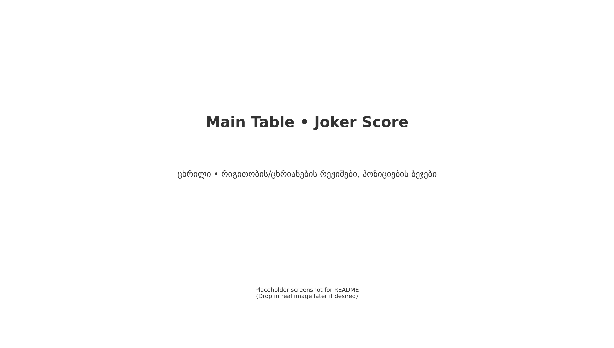
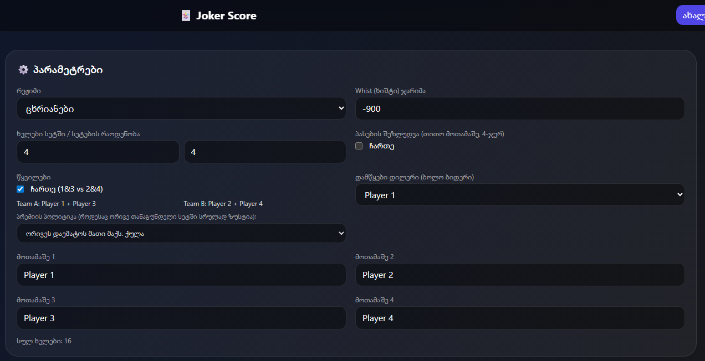
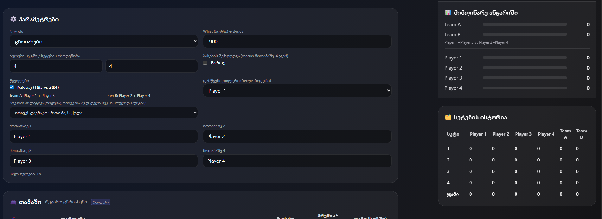
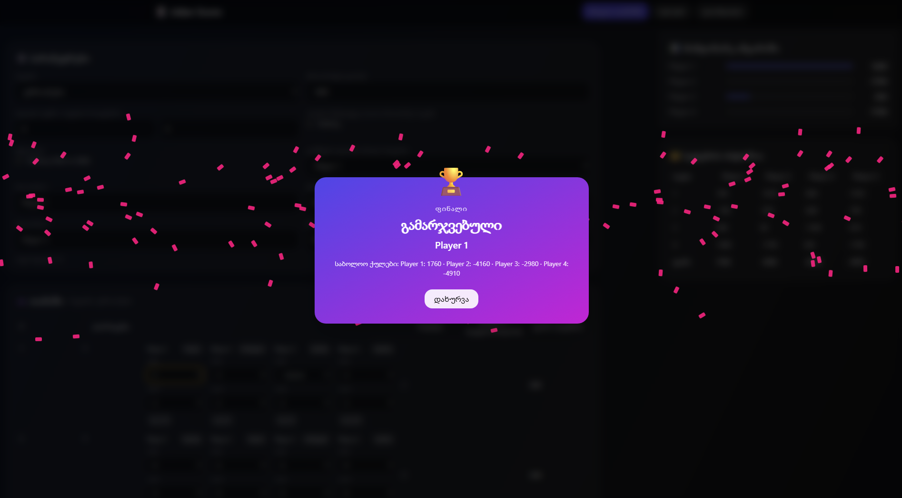
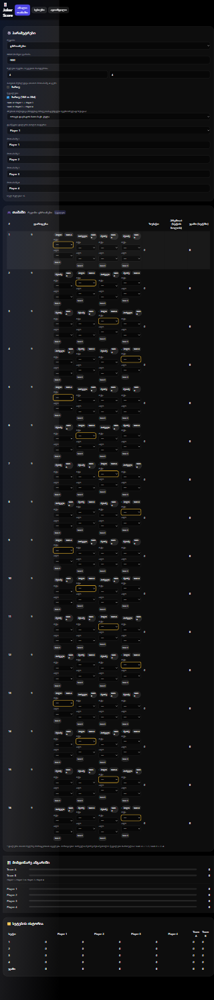

# 🃏 Joker Score

ჯოკერის ქულების თანამედროვე ვებ-აპი (React + Vite + Tailwind). მუშაობს **„ცხრიანების“** და **„რიგითობით“** რეჟიმებზე, აქვს **წყვილები**, პრემიის წესები, ფინალის ანიმაცია და სრულად ავტომატური დათვლები.

> ეს README შეიცავს სქრინშოტებს. ქვემოთ მოცემული გამოსახულებები placeholder-ებია — შეგიძლია ნამდვილი სქრინებიც ჩაანაცვლო `screenshots/` საქაღალდეში, სახელების შენარჩუნებით.

---

## 📸 Screenshots

**Main Table / Dashboard**  


**Settings Panel**  


**Teams & Live Score (Fixed Sidebar)**  


**Finale / Winner Modal**  


**Mobile View (Responsive)**  


---

## ✨ შესაძლებლობები (შეჯამება)

- 2 რეჟიმი: **ცხრიანები** და **რიგითობით**
- დილერის მორიგეობა, პოზიციების ბეჯები *(პირველი/მეორე/მესამე/ბოლო)*
- ბიდის წესები ორივე ტიპზე (პასის/„შემავსებლის“ შეზღუდვები დილერზე)
- „აიღო“ ველების ჯამური ლიმიტი = დარიგებული რაოდენობა
- ხიშტი: „რიგითობით“ ავტომატური; „ცხრიანები“ კონფიგურირებადი
- პასების ლიმიტი (არასავალდებულო) – 4 პასი თითო მოთამაშეზე
- პრემია ინდივიდუალურად და წყვილებში *(Both add / Opp deduct)*
- გუნდური ქულები (Team A = P1+P3, Team B = P2+P4)
- Fixed Sidebar (Live Score + History), სტაბილური UI გრძელ სახელებზე

---

## 🚀 დაყენება

> საჭიროა Node.js 18+

```bash
# 1) unzip
unzip joker-web-app-full-fixed6.zip
cd joker-web-app-full-fixed6

# 2) დაინსტალირე პაკეტები
npm install

# 3) dev სერვერი
npm run dev
# გახსენით: http://localhost:5173

# 4) build + preview
npm run build
npm run preview
```

**Static Deploy:** `dist/` ატვირთე ნებისმიერ static ჰოსტინგზე (Netlify/Vercel/GitHub Pages).

---

## 🧩 შენიშვნები

- UI-ში მოთამაშეთა სვეტები **ფიქსირებულია**; რიგითობა ჩანს მხოლოდ ბეჯებზე.
- დესკტოპზე მარჯვენა პანელები **მუდმივია** (fixed) და სქროლზე **არ იკარგება**.
- გრძელი სახელები **არ „ამტვრევს“** ლეიაუთს — გამოიყენება ელიფსისი.

---

## 💾 შენახვა

- `localStorage`: `joker_user`, `joker_games`
- სესიების მართვა ზედა მენიუდან (შექმნა/გადარქმევა/გასვლა/წაშლა)

**Reset:**  
DevTools → Application → Clear Storage → *Clear site data*  
ან კონსოლში:
```js
localStorage.removeItem('joker_user');
localStorage.removeItem('joker_games');
```

---

## 🛠 Troubleshooting

- შავი ეკრანი → `npm install`, hard refresh (`Ctrl/Cmd+Shift+R`), LocalStorage reset, Node 18+.
- პორტი დაკავებულია → `npm run dev -- --port 5174`.

---

## 📄 ლიცენზია

MIT
